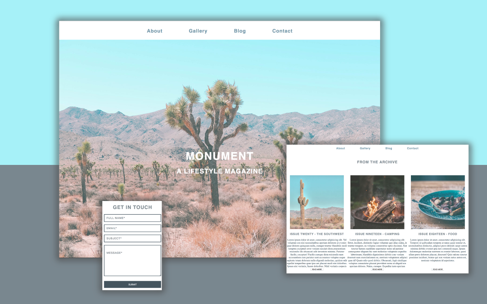

# Translating comps and wireframes into flexible and reusable code




[Live demo](https://juancarlucci.github.io/monument/)

## Process/approach:

Replicate mockup as closely as possible

Use HTML5, CSS3, Sass, jQuery, JavaScript to create responsive app


## DELIVERABLES

### Techonolgy Stack

HTML5, CSS3, Sass, jQuery, JavaScript


## Code Snippets

#### 1. Use of Sass variables and nested rules

```
style.sass

nav
  position: sticky
  top: 0
  left: 0
  background-color: $white
  text-align: center
  padding: 1.250em 17.188em
  display: flex
  align-items: center
  justify-content: space-around
  z-index: 1
  @media screen and (max-width: $break-small)
    display: block
    width: 100%
    padding: 10px 0px
    display: flex
    flex-direction: column
    justify-content: space-between

```
#### 2. Semantic HTML5

```
Index.html

<nav>
  <a href="#about">About</a>
  <a href="#gallery">Gallery</a>
  <a href="blog.html">Blog</a>
  <a href="#">Contact</a>
</nav>
<header class="vertically-centered" id="landing-header">
  <div>
    <h1><a href="">Monument</a></h1>
    <h2>A Lifestyle Magazine</h2>
  </div>
</header>

<section class="archive">

  <h2>From the archive</h2>

  <div class="flex wrap">
    <article class="card">
      
      <h3>Issue Twenty - The Southwest</h3>

      <p>Lorem ipsum dolor sit amet, consectetur adipisicing elit. Vel voluptate eos nisi necessitatibus aperiam dolorem ut eveniet quae dolores quisquam nulla, cumque tenetur blanditiis modi tempora excepturi error veniam suscipit dicta praesentium reiciendis illo obcaecati odit inventore minima. Pariatur facilis, excepturi! Facilis cumque dicta reiciendis nam accusantium cum pariatur sunt accusamus voluptas eaque sapiente totam dolorum nulla eligendi molestiae, quidem odit repellat temporibus quae ipsa aut placeat modi sint doloribus. Ipsum nisi veritatis, facere doloribus. Nihil veritatis corporis eaque odio.</p>

      <button>Read More</button>

    </article>
```


#### 3. Appropriate use of Flexbox

```
display: flex
align-items: center
justify-content: space-around

```

#### 4. Media queries for responsive behavior


```
landing.sass

.about
  background-color: $color_humming_bird
  padding: 7.500em
  text-align: center
  @media screen and (max-width: $break-small)
    padding: 7.500em .5em

```

#### 5. Front end validation for user form

```
main.js

if (fieldType === 'email') {
  var re = /^(([^<>()[\]\\.,;:\s@\"]+(\.[^<>()[\]\\.,;:\s@\"]+)*)|(\".+\"))@((\[[0-9]{1,3}\.[0-9]{1,3}\.[0-9]{1,3}\.[0-9]{1,3}\])|(([a-zA-Z\-0-9]+\.)+[a-zA-Z]{2,}))$/;
  var isValidEmailAddress = re.test($currentField.val());
  if (!isValidEmailAddress) {
    $currentField.addClass('error');
    $currentField.siblings('.error-message').text('Please enter a valid email address.').fadeIn();

    return;
  }

}

```


#### 6. Smooth scrolling across pages

```
main.js

document.querySelectorAll('a[href^="#"]').forEach(anchor => {
    anchor.addEventListener('click', function (e) {
        e.preventDefault();

        document.querySelector(this.getAttribute('href')).scrollIntoView({
            behavior: 'smooth'
        });
    });
});

```
7. Use HTML5 and CSS Validators


